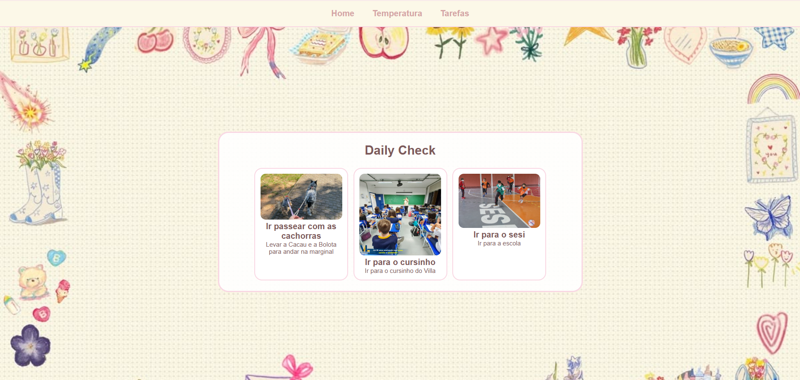
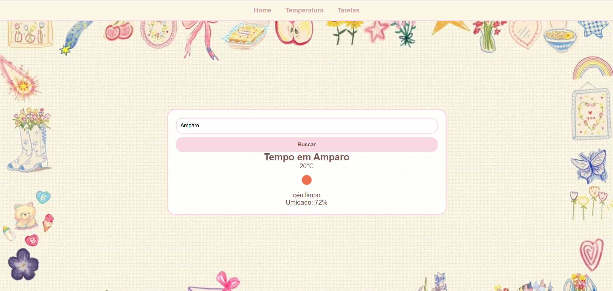
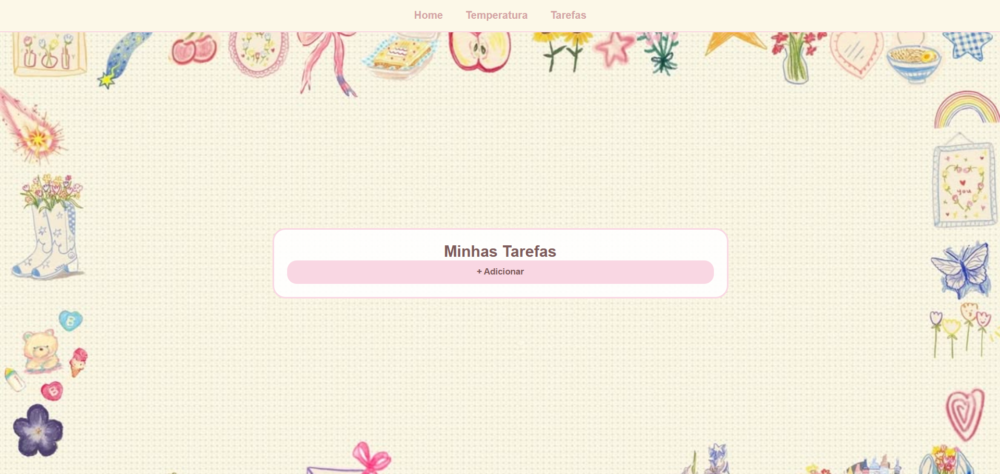
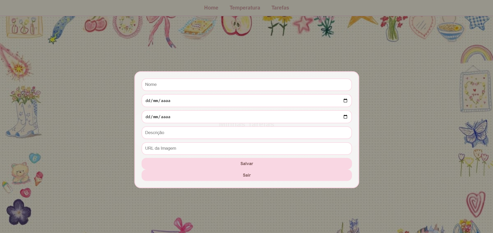

# 📋 Daily Check — Sistema de Gestão Diária

> Aplicação web fullstack para atividade avaliativa, unindo monitoramento climático em tempo real com gerenciamento de tarefas.

---

## 🖼️ Imagens do projeto

<p align="center">
  
  
</p>
<p align="center">
  
  
</p>

---

## ✨ Funcionalidades

- 🌤️ Consulta climática em tempo real com API
- ✅ Criação, edição e remoção de tarefas com Modal
- 📊 Home com visualização de cards
  
---

## 🛠️ Tecnologias

### Front-End


### Back-End


---

## 🚀 Como Executar

### Pré-requisitos

- [Node.js](https://nodejs.org/) 
- [MySQL](https://www.mysql.com/) 

### 1. Clone o repositório

```bash
git clone https://github.com/IsabelleBorges26/Daily-Check.git
cd daily-check
```

### 2. Configure o Back-End

```bash
cd Back-End
npm install
```

Crie o arquivo `.env` na pasta `Back-End/` com o seguinte conteúdo:

```env
PORT=3000 DATABASE_URL="mysql://root@localhost:3306/DailyCheck"
```

### 3. Execute as migrações do banco

```bash
npx prisma migrate dev
```

### 4. Inicie o servidor

```bash
npm start
```

> O servidor estará disponível em `http://localhost:3000`

### 5. Abra o Front-End

Abra o arquivo `index.html` diretamente no navegador ou utilize uma extensão como **Live Server** no VS Code.

---

## 🔌 Endpoints da API

| Método | Rota | Descrição |
|--------|------|-----------|
| `GET` | `/tarefas` | Lista todas as tarefas |
| `POST` | `/tarefas` | Cria uma nova tarefa |
| `PUT` | `/tarefas/:id` | Atualiza uma tarefa |
| `DELETE` | `/tarefas/:id` | Remove uma tarefa |

---

## 📌 Observações

- Certifique-se de que o MySQL está rodando antes de iniciar o servidor.
- A chave da API de clima deve ser configurada diretamente no `script.js`.
- O arquivo `.env` **não deve** ser versionado — adicione ao `.gitignore`.

---

## Feito por: Isabelle Borges 🩷
